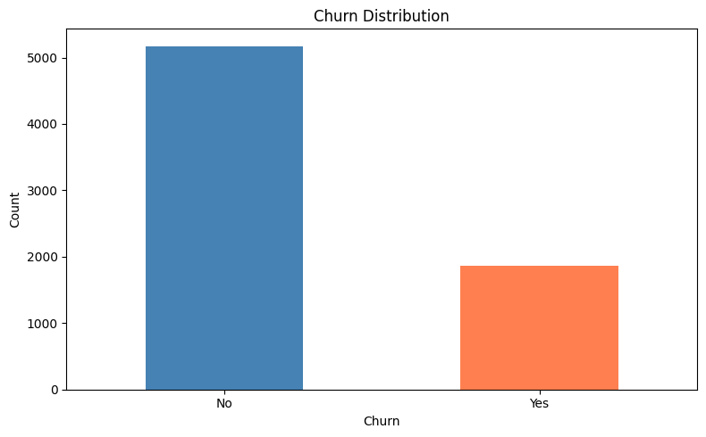
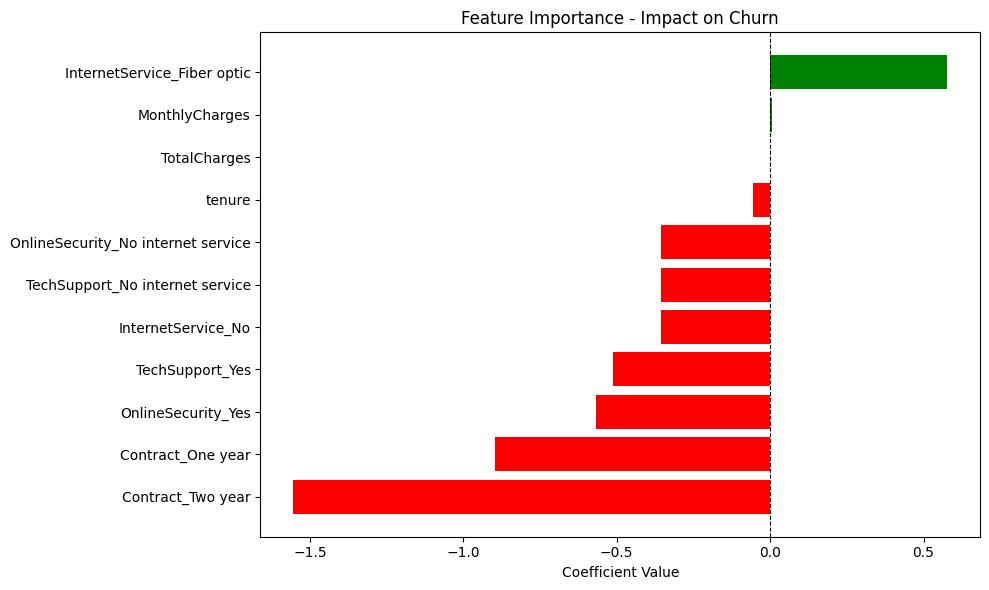
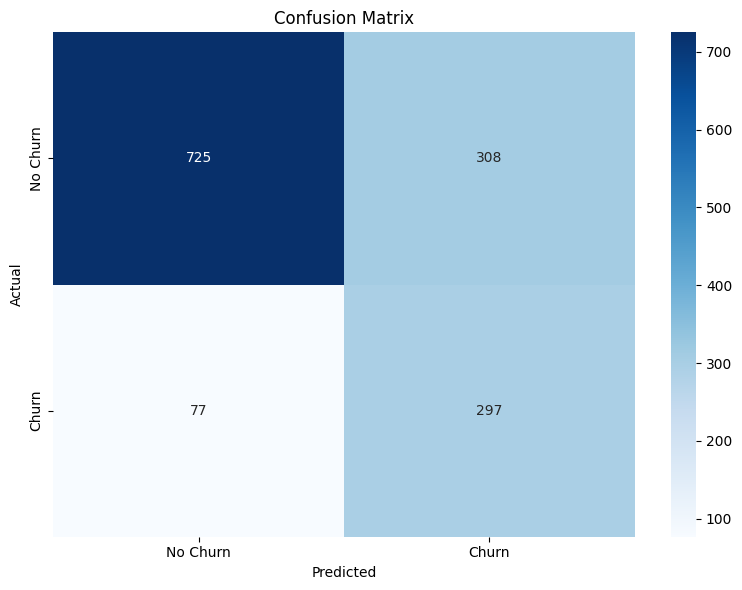
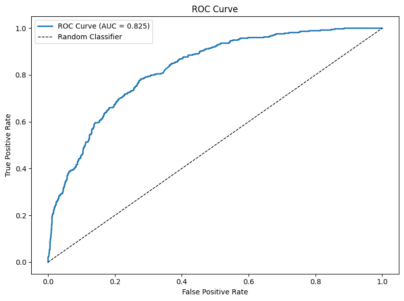

# Customer Churn Analysis & Prediction


---

## Overview

This project performs comprehensive customer churn analysis for a telecommunications company using both exploratory data analysis (EDA) and predictive modeling. By analyzing customer demographics, service usage patterns, and contract details, the project identifies key churn drivers and builds a machine learning model to predict which customers are at risk of leaving, enabling proactive retention strategies.

**Business Problem:** Telecommunications companies face 15-25% annual churn rates, costing billions in lost revenue and requiring 5-10x more resources to acquire new customers than retain existing ones. Without data-driven insights, retention efforts are reactive rather than preventive.

---

## Key Features

- **Comprehensive EDA** analyzing 7,043 customer records across demographics, service usage, and contract patterns
- **79.4% churn recall** — predictive model identifies 297 of 374 actual churners, enabling targeted retention campaigns
- **ROC-AUC score of 0.825** — excellent discrimination ability between churners and non-churners
- Feature importance analysis revealing contract type, tech support, and internet service as primary churn drivers
- Interactive visualizations including distribution plots, correlation heatmaps, and ROC curves
- Actionable business recommendations for retention strategy optimization

---

## Dataset

| Property | Detail |
|----------|--------|
| Source | [Kaggle - Telco Customer Churn Dataset](https://www.kaggle.com/datasets/blastchar/telco-customer-churn) |
| Size | 7,043 customers |
| Time Period | Historical snapshot |
| Churn Rate | 26.6% (1,869 churned, 5,174 retained) |
| Features | 20+ variables including demographics, services, contracts, charges |

### Feature Categories

**Demographics:**
- Gender, SeniorCitizen, Partner, Dependents

**Services:**
- PhoneService, MultipleLines, InternetService (DSL/Fiber optic/None)
- OnlineSecurity, OnlineBackup, DeviceProtection, TechSupport
- StreamingTV, StreamingMovies

**Account Information:**
- Tenure (months), Contract (Month-to-month/One year/Two year)
- PaperlessBilling, PaymentMethod
- MonthlyCharges, TotalCharges

**Target Variable:**
- Churn (Yes/No)

---

## Tech Stack

- **Python 3.9+**
- **Scikit-learn** — Logistic Regression with class balancing
- **Pandas** — data manipulation and feature engineering
- **NumPy** — numerical computations
- **Matplotlib / Seaborn** — visualizations and EDA plots
- **Jupyter Notebook** — analysis environment (2 notebooks: EDA + Modeling)

---

## Installation

```bash
# Clone the repository
git clone https://github.com/yourusername/customer-churn-analysis.git
cd customer-churn-analysis

# Create and activate virtual environment
python -m venv venv
source venv/bin/activate  # On Windows: venv\Scripts\activate

# Install dependencies
pip install -r requirements.txt
```

---

## Project Structure

```
customer-churn-analysis/
├── README.md
├── requirements.txt
├── dataset/
│   └── Telco_Customer_Churn.csv
├── notebooks/
│   ├── churn_analysis.ipynb (EDA)
│   └── churn_analysis_model.ipynb (Modeling)
└── images/
    ├── banner.png
    ├── churn_distribution.png
    ├── feature_importance.png
    ├── confusion_matrix.png
    └── roc_curve.png
```

---

## How to Run

### Part 1: Exploratory Data Analysis
```bash
jupyter notebook notebooks/churn_analysis.ipynb
```
Explores customer patterns, visualizes churn drivers, and identifies key features.

### Part 2: Predictive Modeling
```bash
jupyter notebook notebooks/churn_analysis_model.ipynb
```
Builds Logistic Regression model, evaluates performance, and generates predictions.

---

## Results

### Model Performance

| Metric | Score | Interpretation |
|--------|-------|----------------|
| **Recall** | **79.4%** | Identifies 297 of 374 actual churners — primary objective achieved |
| **ROC-AUC** | **82.5%** | Excellent discrimination ability |
| **Accuracy** | 72.6% | Overall prediction correctness |
| **Precision** | 49.1% | Acceptable false alarm rate for retention campaigns |
| **F1 Score** | 60.7% | Balanced precision-recall performance |

### Key Findings from EDA

**Churn Rate:** 26.6% overall (1,869 of 7,043 customers)

**Highest Risk Segments:**
- **Month-to-month contracts:** 42% churn rate vs 3% for two-year contracts
- **Fiber optic internet:** 41% churn rate vs 19% for DSL
- **No tech support:** 42% churn rate vs 15% with tech support
- **New customers (0-12 months tenure):** 50%+ churn rate

**Lowest Risk Segments:**
- **Two-year contracts:** 3% churn rate — 14x lower than month-to-month
- **Long-term customers (60+ months):** <10% churn rate
- **Customers with online security:** 15% churn rate

### Feature Importance (Model Coefficients)

**Top Churn Drivers (Increase Risk):**
1. **InternetService_Fiber optic** (+0.577) — highest positive coefficient
2. **Contract_Month-to-month** (baseline) — lack of commitment increases risk

**Top Retention Factors (Decrease Risk):**
1. **Contract_Two year** (-1.554) — strongest protective factor
2. **Contract_One year** (-0.897) — moderate protection
3. **OnlineSecurity_Yes** (-0.567) — security services reduce churn
4. **TechSupport_Yes** (-0.512) — support access critical for retention
5. **Tenure** (-0.054) — cumulative loyalty effect over time

### Visualizations

**1. Churn Distribution**
The dataset shows a 73.4% retention rate with 5,174 retained customers and 26.6% churn rate with 1,869 churned customers, indicating significant class imbalance handled through model balancing.



**2. Feature Importance - Model Coefficients**
Contract type dominates churn prediction, with two-year contracts providing the strongest protection (-1.554 coefficient) while fiber optic internet increases risk (+0.577 coefficient).



**3. Confusion Matrix**
The model correctly identifies 297 of 374 churners (79.4% recall) with 725 true negatives, 308 false positives, and only 77 missed churners (false negatives).



**4. ROC Curve (AUC = 0.825)**
The ROC curve demonstrates excellent discrimination ability, positioned well above the random baseline with 82.5% probability of correctly ranking a churner higher than a non-churner.



### Business Interpretation

The 79.4% recall means the model identifies approximately **4 out of 5 customers** who will churn, enabling proactive retention campaigns. The 49.1% precision indicates half of flagged customers will actually churn, which is acceptable for retention programs where contacting additional customers is preferable to missing at-risk churners.

**ROI Estimate:** With typical telecom CLV of $1,500 and retention campaign cost of $75/customer, the model enables a **10x return** by identifying 297 true churners for targeted intervention.

---

## Business Recommendations

### Top Priority Actions

**1. Contract Upgrade Incentive Program**
- **Target:** Month-to-month customers (42% churn rate)
- **Action:** Offer discounts for one-year or two-year contract upgrades
- **Expected Impact:** 14x reduction in churn risk (42% → 3%)

**2. Fiber Optic Service Quality Improvement**
- **Target:** Fiber optic customers (41% churn rate vs 19% DSL)
- **Action:** Investigate service quality issues, improve network reliability
- **Expected Impact:** 50% reduction in fiber churn (41% → 20%)

**3. New Customer Onboarding Enhancement**
- **Target:** 0-12 month tenure customers (50%+ churn rate)
- **Action:** Dedicated onboarding specialist, 30/60/90 day check-ins
- **Expected Impact:** 30% reduction in early-stage churn

**4. Predictive Retention Workflow**
- **Target:** Model-flagged high-risk customers (churn probability >0.7)
- **Action:** Automated retention workflow with escalating interventions
- **Expected Impact:** 60-70% win-back rate on flagged customers

---

## Challenges and Limitations

- **Class imbalance:** 73:27 ratio requires careful model tuning
- **49.1% precision:** Half of flagged customers are false positives
- **Snapshot data:** Single time point lacks customer journey tracking
- **Missing variables:** No customer satisfaction scores, support ticket data, competitor pricing

---

## Future Work

- **Ensemble methods:** Random Forest, Gradient Boosting for improved accuracy
- **Longitudinal data:** Track customer behavior changes over 12-24 months
- **Real-time scoring:** API for live churn risk assessment
- **Explainable AI:** SHAP values for transparent customer-level churn reasons
- **A/B testing framework:** Measure retention campaign effectiveness

---

## Practical Applications

- **Proactive retention campaigns** — contact at-risk customers before they churn
- **Contract renewal optimization** — target month-to-month customers with upgrade incentives
- **Service quality monitoring** — identify fiber optic quality issues driving churn
- **Resource allocation** — focus retention team on model-flagged high-risk customers
- **Executive dashboards** — real-time churn risk monitoring for business leadership
